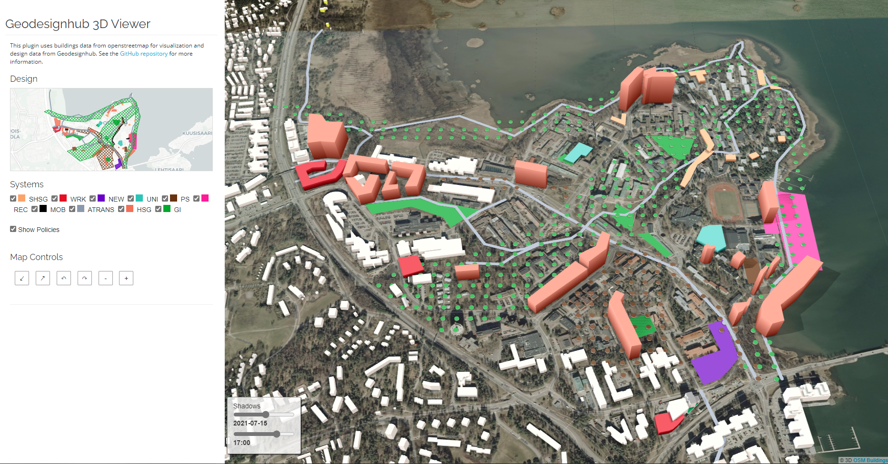
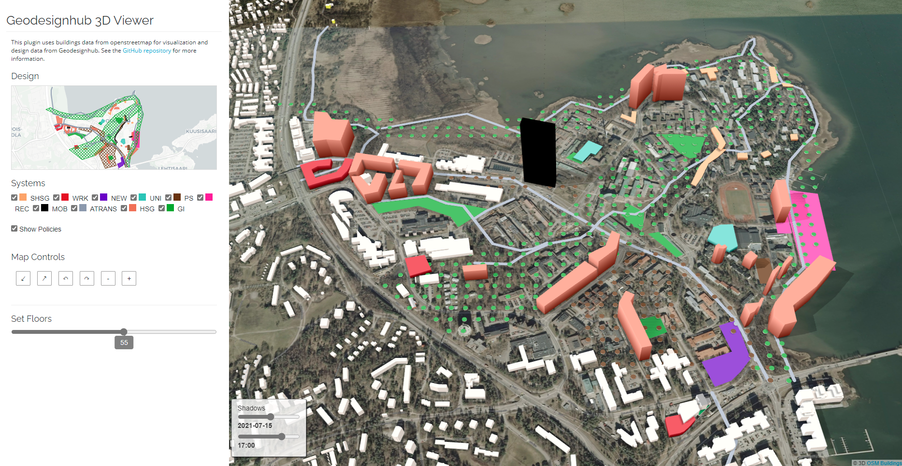
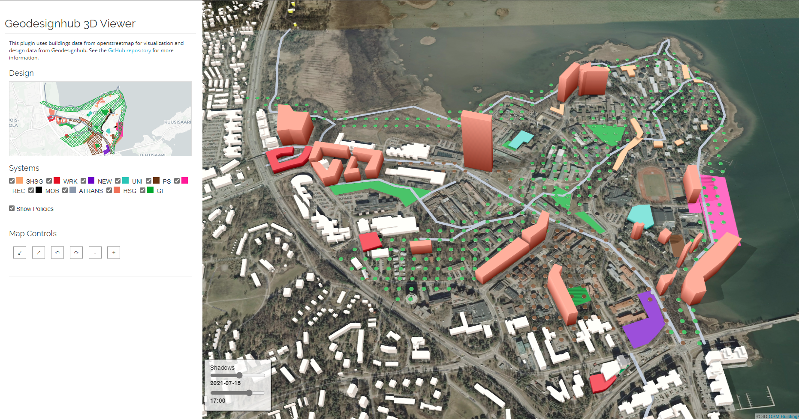

# Geodesignhub 3DViewer

A fully integrated 3D viewer for ideas negotiated on Geodesignhub. This 1-click plugin helps you visualize the outcomes of negotiations and focuses on buildings / urban form. You can 

## Screenshots

See the standard view for a design here, with buildings, policies and roads and the ability to turn on / off individual themes. 

Click on a building to set it's height, if you set the height in Geodesignhub , it  but here you can change the height for any scenarios / changes you

Once set the new building can be seen taller to the number of floors set eariler.

## Adding the plugin

The plugin can be added to a project through the project administration panels.